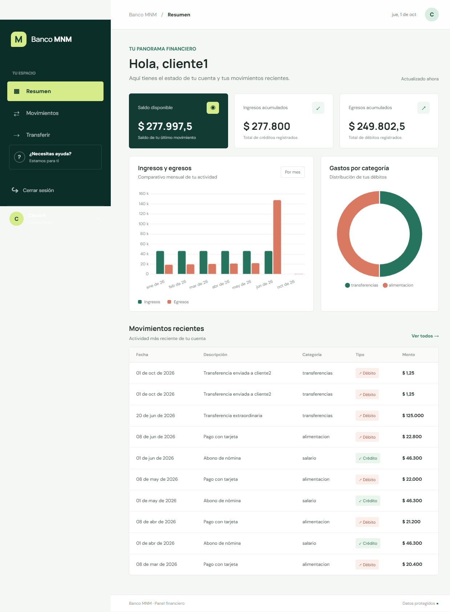

# Banco MNM: Vagrant y Docker

Aplicación bancaria educativa en FastAPI con dos APIs independientes, una interfaz web, PostgreSQL y Nginx. El mismo sistema se puede ejecutar de dos maneras:

- **Vagrant:** cuatro máquinas virtuales Ubuntu, una para PostgreSQL, una para AUTH, una para BANCO y una para Nginx/frontend.
- **Docker Compose:** los mismos cuatro servicios como contenedores en el host.

En ambos modos AUTH y BANCO son servicios separados; ya no se despliega la API monolítica Users/Orders/Payments.

## Arquitectura

```text
                         Navegador
                             |
                   http://localhost:8081 (Vagrant)
                   http://localhost:8080 (Docker)
                             |
                      Nginx + frontend
                             |
                 +-----------+-----------+
                 |                       |
          AUTH :8001                 BANCO :8002
       login y tokens JWT       cuentas, ledger y transferencias
                 |                       |
                 +-----------+-----------+
                             |
                     PostgreSQL :5432
                     auth_db / banco_db
```

En Vagrant cada bloque se ejecuta en su propia VM dentro de una red privada:

| VM | IP privada | Servicio |
| --- | --- | --- |
| `database` | `192.168.56.20` | PostgreSQL, `auth_db` y `banco_db` |
| `auth` | `192.168.56.21` | API AUTH, puerto `8001` |
| `bank` | `192.168.56.22` | API BANCO, puerto `8002` |
| `gateway` | `192.168.56.23` | Nginx y frontend, puerto `80` |

Solo el gateway publica un puerto al host en Vagrant (`localhost:8081`). En Docker, Nginx publica `localhost:8080`. Ambas opciones pueden funcionar a la vez. La base de datos de cada modo es independiente.

## Alcance de la entrega y dominio

La entrega corre **localmente en el equipo Windows** usando Vagrant y VirtualBox; no está desplegada en servidores de nube. El servidor de frontend es la VM `gateway` (Nginx sirve los archivos estáticos), las APIs backend están en las VMs `auth` y `bank`, y PostgreSQL en `database`. Las direcciones `192.168.56.x` pertenecen a la red privada de VirtualBox; el acceso desde Windows se realiza por `http://localhost:8081`.

`bancomnm.xyz` aparece únicamente como sufijo de los correos de demostración (`cliente1@bancomnm.xyz`, por ejemplo). **No se configura DNS ni se publica un sitio en ese dominio** en esta entrega. La aplicación solo está disponible localmente: `localhost:8081` con Vagrant o `localhost:8080` con Docker Compose.

## Motivación y problema

El proyecto simula un banco para practicar autenticación, autorización por roles y despliegue de servicios separados. Un cliente necesita consultar su cuenta y enviar dinero a otro cliente; un analista necesita observar indicadores agregados y alertas de movimientos grandes. AUTH gestiona identidad y tokens, mientras BANCO ejecuta las operaciones financieras y mantiene el ledger. No se conecta a una entidad bancaria real ni mueve dinero real.

## Estructura del proyecto

```text
vagrant-monlito-class/
├── Vagrantfile                 # orquesta las cuatro VMs
├── vagrant/
│   ├── provision.sh            # instala Docker y ejecuta el servicio de cada VM
│   └── nginx.conf              # proxy entre VMs para Vagrant
├── docker-compose.yml          # despliegue local de los cuatro contenedores
├── .env.example                # plantilla de secretos y opciones
├── BANCO_MNM.md                # rutas y detalles del dominio bancario
├── app/
│   ├── auth_service/            # login, usuarios y JWT
│   ├── bank_service/            # cuentas, movimientos, transferencias y alertas
│   ├── common/                  # validación de JWT y errores compartidos
│   ├── scripts/                 # importador de dataset Berka
│   ├── tests/                   # pruebas automatizadas de las APIs
│   ├── Dockerfile
│   └── requirements*.txt
├── database/init/               # inicialización de banco_db
├── frontend/                    # aplicación web
└── nginx/default.conf           # proxy para Docker Compose
```

## Requisitos y configuración

- Para Vagrant: Vagrant y VirtualBox instalados y operativos; reserva aproximadamente 3 GB de RAM para las cuatro VMs.
- Para Docker Compose: Docker Desktop con `docker compose` v2.
- Para las pruebas locales: Python 3 y pip.

Desde la carpeta del repositorio, crea `.env` si aún no existe y edita `POSTGRES_PASSWORD` y `JWT_SECRET`. `JWT_SECRET` debe ser una cadena privada de al menos 32 caracteres. No reemplaces un `.env` local que ya tenga tus valores.

```powershell
if (-not (Test-Path .env)) { Copy-Item .env.example .env }
```

Vagrant lee esta configuración dentro de cada VM para iniciar los contenedores. Mantén el archivo en formato `CLAVE=VALOR`; no subas `.env` a Git.

## Despliegue con Vagrant

Ejecuta los comandos desde la carpeta que contiene este `Vagrantfile`:

```powershell
vagrant validate
vagrant up --provider=virtualbox
vagrant status
Invoke-RestMethod http://127.0.0.1:8081/health
```

El primer `vagrant up` crea cuatro VMs, instala Docker en cada una, inicia PostgreSQL, espera a que responda antes de levantar AUTH y BANCO, y finalmente publica Nginx. La primera ejecución descarga Ubuntu e imágenes Docker y puede tardar varios minutos.

Abre `http://localhost:8081` para usar la aplicación. La respuesta del healthcheck debe ser `status=ok`. Para revisar un servicio:

```powershell
vagrant ssh database
vagrant ssh auth
vagrant ssh bank
vagrant ssh gateway
```

Dentro de una VM, `sudo docker ps` muestra su contenedor. Para volver a aplicar cambios de código o configuración, provisiona el nodo afectado; para cambios compartidos de `app/`, provisiona ambas APIs:

```powershell
vagrant provision auth
vagrant provision bank
vagrant provision gateway
```

Para apagar las VMs sin borrarlas, usa `vagrant halt`; para iniciarlas de nuevo, `vagrant up`. `vagrant destroy` elimina las cuatro máquinas y también los datos PostgreSQL que están almacenados en la VM `database`. El archivo `.env` del host permanece.

## Despliegue con Docker Compose

Desde la raíz del repositorio:

```powershell
docker compose config --quiet
docker compose up --build -d
docker compose ps
Invoke-RestMethod http://127.0.0.1:8080/health
```

Abre `http://localhost:8080`. Para consultar logs o detener los servicios:

```powershell
docker compose logs -f
docker compose down
```

`docker compose down` conserva el volumen `postgres_data`; `docker compose down -v` lo elimina permanentemente. Esta base es independiente de la que corre en Vagrant.

## Roles de usuario

AUTH valida el correo y la contraseña, y emite un JWT con el rol y la cuenta asociada. BANCO valida ese token en cada operación y aplica autorización por rol.

| Rol | Qué puede hacer | Qué no puede hacer |
| --- | --- | --- |
| `cliente` | Consultar saldo, ingresos, gastos, movimientos y destinatarios; enviar dinero a otro cliente desde su propia cuenta. | Consultar indicadores globales, alertas de analista o transferir desde otra cuenta. |
| `analista` | Ver el resumen global, volumen mensual y los datos de las transacciones que superan el umbral de alertas. | Ver el saldo o historial completo de una cuenta, consultar destinatarios o enviar transferencias. |

Usuarios de demostración (solo desarrollo):

- Cliente: `cliente1@bancomnm.xyz` a `cliente5@bancomnm.xyz`; contraseña `Cliente123!`.
- Analista: `analista1@bancomnm.xyz` o `analista2@bancomnm.xyz`; contraseña `Analista123!`.

Desactiva `SEED_DEMO_DATA` y cambia todos los secretos antes de cualquier despliegue real.

## Esquema de base de datos

`database/init/01-create-databases.sh` crea `banco_db`; PostgreSQL crea `auth_db` desde `POSTGRES_DB`. Cada API crea sus tablas al arrancar mediante SQLAlchemy (`Base.metadata.create_all`). El modelo `usuarios` vive en `auth_db`; `cuentas` y `transacciones`, en `banco_db`.

| Base | Tabla | Columnas y restricciones |
| --- | --- | --- |
| `auth_db` | `usuarios` | `id INTEGER` PK; `email VARCHAR(255)` único e indexado; `password_hash VARCHAR(255)`; `role VARCHAR(20)` indexado; `account_id INTEGER` nullable. |
| `banco_db` | `cuentas` | `id INTEGER` PK; `opened_on DATE`; `username VARCHAR(80)` nullable y único. |
| `banco_db` | `transacciones` | `id INTEGER` PK; `account_id INTEGER` FK a `cuentas.id` e indexado; `date DATE` indexada; `type VARCHAR(10)` indexado; `operation VARCHAR(100)`; `amount NUMERIC(14,2)`; `balance_after NUMERIC(14,2)`; `category VARCHAR(100)` indexada. |

`account_id` en `usuarios` no es una FK: AUTH y BANCO guardan sus datos en bases separadas. La relación de transacciones con cuentas sí está declarada como FK dentro de `banco_db`. `username` permite resolver el alias de destino de una transferencia y admite `NULL` para cuentas históricas sin alias.

## Transferir dinero

Inicia sesión como cliente y abre **Transferir**. Elige un alias disponible, indica el importe en COP y confirma. Los alias demo son `cliente1`, `cliente2`, etc.; actualmente son la parte anterior a `@` del correo. La API solo ofrece como destinatarios otras cuentas con alias.

El backend identifica la cuenta de origen por el JWT, no por un ID enviado desde el navegador. Valida que el destinatario exista, que sea otra cuenta y que haya saldo suficiente. Registra un débito al emisor y un crédito al destinatario en una única transacción PostgreSQL; si falla una operación, no se confirma ninguna. El nuevo saldo aparece en el resumen y ambos apuntes quedan en los movimientos.

API para clientes:

```text
GET  /api/cliente/destinatarios
POST /api/cliente/transferencias
```

Ejemplo del cuerpo de la petición `POST`:

```json
{
  "destinatario": "cliente2",
  "monto": "1250.00"
}
```

El token se envía en `Authorization: Bearer <token>`. Se rechazan destinatarios inexistentes, envíos a la propia cuenta e importes mayores que el saldo. Las rutas y filtros restantes están en [BANCO_MNM.md](BANCO_MNM.md).

## Pruebas

Desde la raíz del repositorio, en PowerShell:

```powershell
python -m pip install -r app/requirements-dev.txt
$env:PYTHONPATH = (Resolve-Path app).Path
python -m pytest app/tests -q
```

Las pruebas usan SQLite temporal y no necesitan arrancar los contenedores.

### Evidencias de ejecución en Windows

Salida real de pytest ejecutado desde PowerShell en la raíz del repositorio:

```text
....                                                                     [100%]
4 passed in 4.21s
```

Salida real de las llamadas autenticadas al gateway Vagrant desde Windows PowerShell:

```text
WINDOWS_HEALTH=ok; LOGIN_ROLE=cliente; SUMMARY=ok; AVAILABLE_RECIPIENTS=4
HEALTH=ok; ROLE=cliente; TRANSFER=completada; RECIPIENT=cliente2; AMOUNT=1.25
```

Captura real del dashboard después de iniciar sesión como cliente en el servidor local de Vagrant:



La captura muestra la interfaz autenticada; la salida de pytest se conserva arriba como texto para que sea copiable y verificable. Para generar evidencia nueva, repite los comandos de las secciones Vagrant y Pruebas en tu propio equipo.
